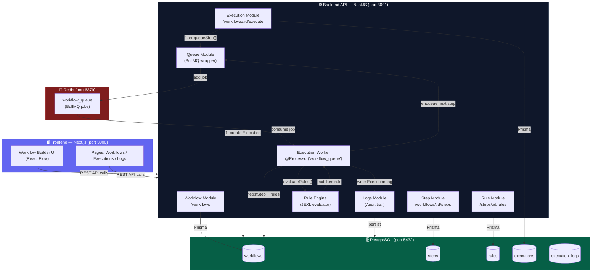
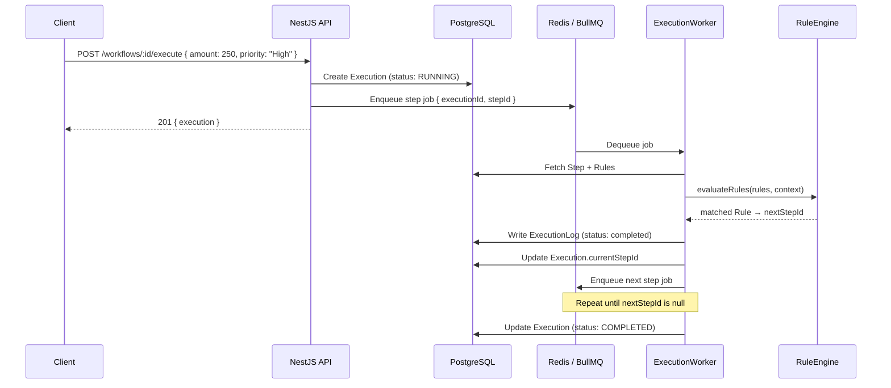

# Workflow Automation Engine — System Architecture

## 1. Textual Explanation

The system is composed of four major layers that work together to define, manage, and execute automated workflows.

---

### Layer 1 — Frontend (Next.js)

The frontend is a **Next.js** web application that provides the visual interface for users to:

- Create and manage workflows and their steps/rules via REST API calls
- Visualise workflow graphs using **React Flow**
- Monitor execution status and browse execution logs in real time

It communicates with the backend exclusively via **HTTP REST APIs**, pointing to `http://localhost:3001`.

---

### Layer 2 — Backend API (NestJS)

The **NestJS** API is the backbone of the system. It exposes a clean REST interface and orchestrates all business logic through modular NestJS providers:

| Module | Responsibility |
|---|---|
| **Workflow Module** | CRUD for workflow definitions, input schemas, versioning |
| **Step Module** | CRUD for steps (task / approval / notification) linked to workflows |
| **Rule Module** | CRUD for JEXL-based conditional rules attached to steps |
| **Execution Module** | Starts executions, manages state, exposes cancel/retry endpoints |
| **Rule Engine** | Evaluates JEXL rule conditions against runtime context data |
| **Logs Module** | Creates and queries per-step `ExecutionLog` audit records |
| **Queue Module** | Wraps BullMQ to enqueue and cancel step processing jobs |

Swagger UI is available at `/api-docs`.

---

### Layer 3 — Workflow Engine (Execution Core)

When a workflow is executed, the engine follows this deterministic loop:

1. **Validate** the input against the workflow's `inputSchema`
2. **Create** an [Execution](file:///d:/project%201/backend/src/execution/execution.service.ts#24-68) record (status: `RUNNING`)
3. **Enqueue** the start step as a BullMQ job in Redis
4. **Worker** picks up the job, fetches the step and its rules
5. **Rule Engine** evaluates each rule (sorted by priority) using JEXL
6. The **first matching rule** determines `nextStepId`; if no rules match, the **DEFAULT** rule is used
7. If `nextStepId` is `null` → execution ends (`COMPLETED`)
8. Otherwise → update `currentStepId` and enqueue the next step
9. An **`ExecutionLog`** is written for every step with rule results, timestamps, and any errors

On failure, the step is logged as `failed`, the execution is marked `FAILED`, and the user can trigger a retry.

---

### Layer 4 — Database (PostgreSQL via Prisma)

All state is persisted in **PostgreSQL** through the **Prisma ORM**:

- `workflows`, `steps`, `rules` — workflow definitions
- `executions` — live execution state tracking
- `execution_logs` — immutable audit trail per step

---

### Layer 5 — Queue System (BullMQ + Redis)

**BullMQ** backed by **Redis** handles asynchronous, reliable step processing:

- Jobs are not lost on server restart (Redis persistence)
- Built-in retry support with configurable backoff
- The [ExecutionWorker](file:///d:/project%201/backend/src/execution/execution.worker.ts#17-42) is a `@Processor('workflow_queue')` that processes one step at a time

---

## 2. Architecture Diagram

---

## 3. Request Lifecycle (Sequence)

